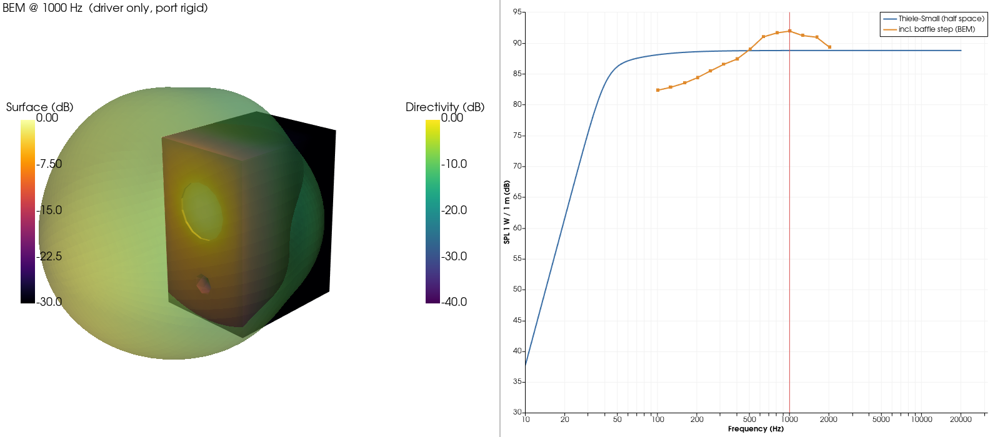
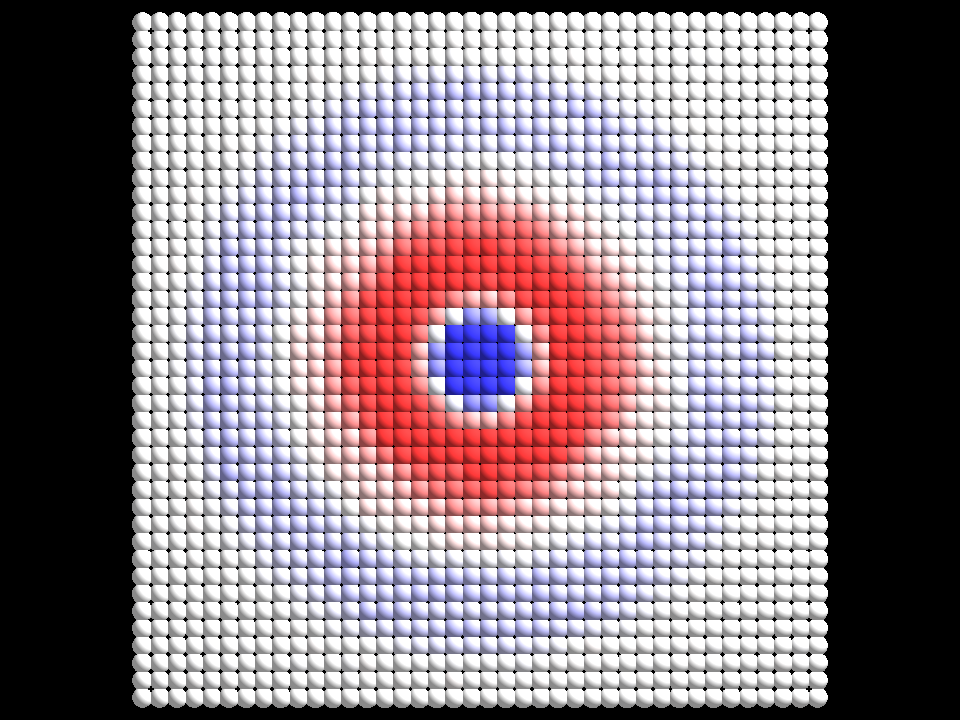
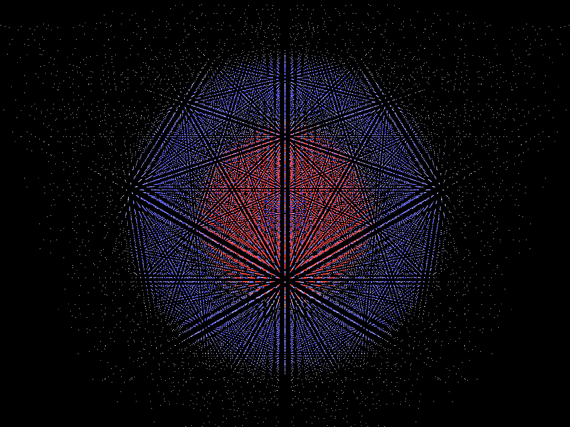

#acou3d

These are some tests of acoustic modeling in 3D.

* `python-pyvista` attempts to model a speaker enclosure and radiating acoustic field, with acoustic interaction between the driver, cabinet and surrounding air (linear BEM) using bempp-cl, gmsh, matplotlib, numba, numpy, pyopencl, pyvista, 
scipy, and vtk.

  

---

* `python-taichi` is a physics-based air-particle simulator, currently showing a monopole point source's transient impact on 64k volumetric particles.  Taichi also runs on GPU if available.

  

  

